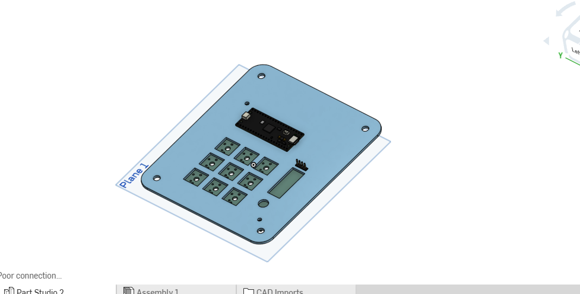
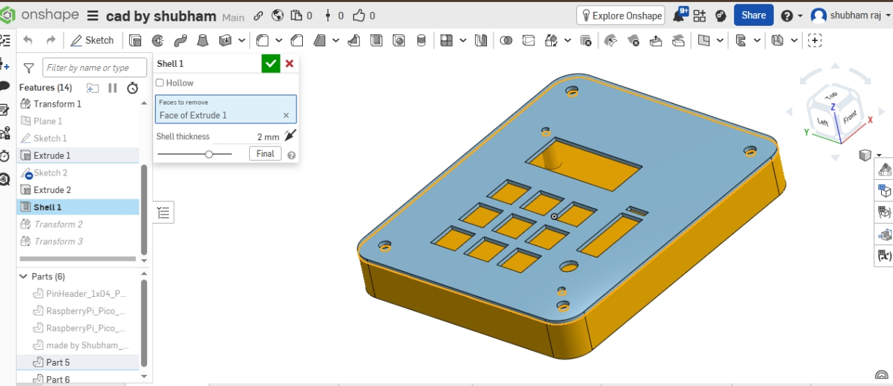

# Hackpad For Editing

A 9-key + rotary encoder macropad built for editors and creators.
Just plug and start editing.

##  What It Does

- 9 mechanical switches, each mapped to a specific editing shortcut
- Rotary encoder for timeline scrubbing (Left/Right arrow)
- reliable keypresses
- Works as a standard USB keyboard
- Built on raspberry pi pico using PlatformIO + Keyboard.h

##  Key Layout & Shortcuts
| Key | Shortcut | Function |
|-----|----------|----------|
| SW1 | Tab | Switch between panels |
| SW2 | Win + Shift + S | Screenshot (Snipping Tool) |
| SW3 | Ctrl + Z | Undo |
| SW4 | Ctrl + Shift + Z | Redo |
| SW5 | End | Jump to end of timeline |
| SW6 | Alt + 2 | Application specific shortcut |
| SW7 | Ctrl + B | Bold / Split clip |
| SW8 | Ctrl + = | Zoom In |
| SW9 | Ctrl + - | Zoom Out |
| Encoder Clockwise | Right Arrow | Scrub timeline forward |
| Encoder Counter-Clockwise | Left Arrow | Scrub timeline backward |

## Wiring

| Component | Pin |
|-----------|-----|
| SW1 | D2 |
| SW2 | D3 |
| SW3 | D4 |
| SW4 | D5 |
| SW5 | D6 |
| SW6 | D7 |
| SW7 | D8 |
| SW8 | D9 |
| SW9 | D10 |
| Encoder A | D20 |
| Encoder B | D21 

## 🚀 How to Flash

1. Install [VS Code](https://code.visualstudio.com/) + PlatformIO extension
2. Clone or download this repo
3. Open `Firmware/` folder in VS Code
4. Connect raspberry pi pico via USB
5. Click Upload in PlatformIO

## PCB & Case

## Author

**Shubham Raj** — [@heyy-Shubham](https://github.com/heyy-Shubham)
