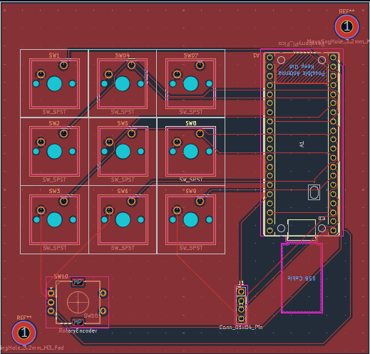
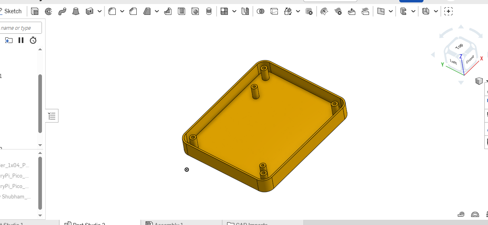

#Project Name ##Hackpad For Editing

I will make this device using 9 sw_cherry_mx (switch) and encoder and 0.91 oled display
just plug and enhance editing leval build for editors

|[Hackpad](Assets/20260427_140940.jpg)

## What does this do
9 sw_cherry_mx mechanichl switch , Every switch maped editing shortcut 
rotary encoder for layer moveing left And right
Using Like a Standerd Usb Keyboard
Firamware using PlatformIO + keyboard.h in raspbarry pi pico micro controllar

## keyboard shortcuts
| key | Shortcut | Funcation |
|------|-----------|-----------|
| SW1 | Tab | Switch between panel |
| SW2 | Win + Swift + S | Screemshot |
| SW3 | Ctrl z | undo |
| SW4 | Ctrl + Swift + z | Redo |
| SW5 | End | Jumpto the end time line |
| SW6 | Alt + 2 | Application specific Shortcut |
| SW7 | Ctrl + B | Split Clip |
| SW8 | Ctrl + = | Zoom in |
| SW9 | Ctrl + - | Zoom Out |
| Encoder Clockwise | Rise Arrow | Time line forward |
| Encoder Anti-Clockwise | Left Arrow | Backward |

## Connectioms 
| Component | Pin | 
|-----------|------|
| SW1 | D2 |
| SW2 | D3 |
| SW3 | D4 |
| SW4 | D5 |
| SW5 | D6 |
| SW6 | D7 |
| SW7 | D8 |
| SW8 | D9 |
| SW9 | D10 |
| Encoder  A | D20 |
| Encoder  B | D21 |

## Firamware Flash in Respberry pi pico
 1. install vs code (https://code.visualstudio.com/)
 2. Add Extension PlatformIO Extension
 3. Select Board And install Firamware

## PCB 

## CAD

##Author
Shubham Raj - @heyy-Shubham(https://github.com/heyy-shubham)

